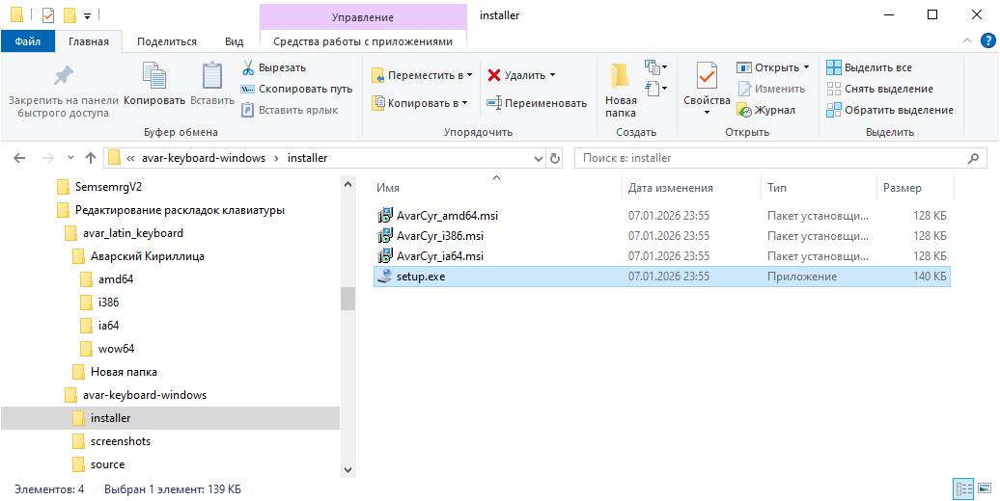
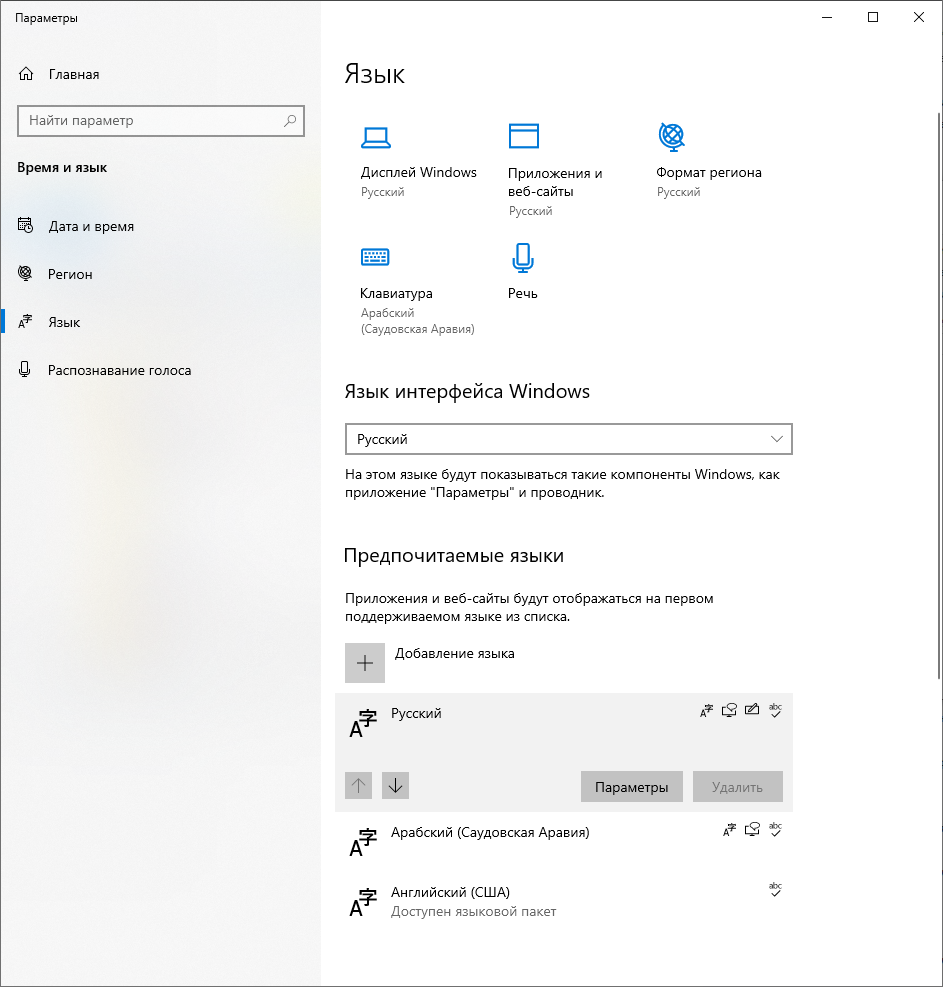
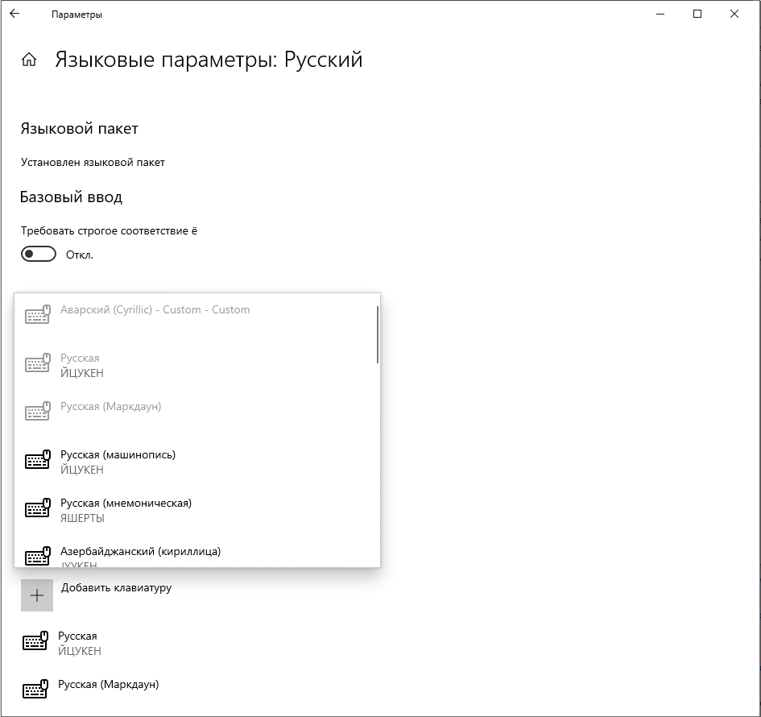
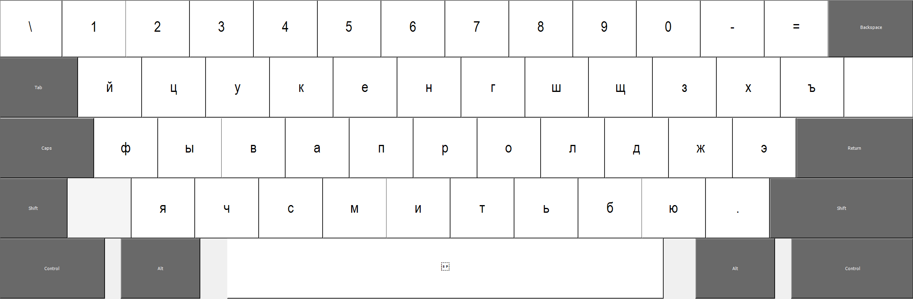
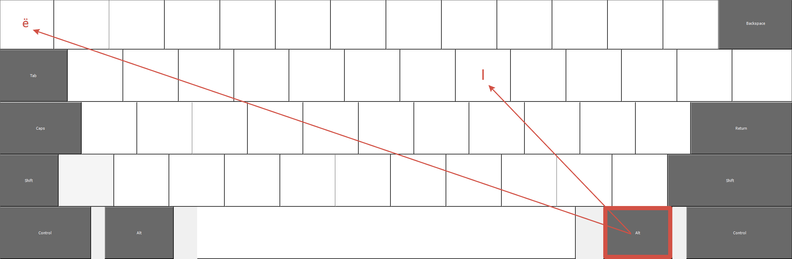

# Раскладка клавиатуры для аварского языка (кириллица)

## Описание
Это пакет для установки пользовательской раскладки клавиатуры Windows, позволяющей удобно печатать на аварском языке с использованием стандартной кириллицы и всех специфических символов.

**Автор:** Dag-tools
**Версия:** 1.0 (2026)

## Системные требования
*   Windows 7, 8, 10, 11 (32-битная или 64-битная версия).
*   Установленный пакет .NET Framework (обычно есть в системе по умолчанию).

## Установка

1.  **Скачайте установщик:**
    *   Перейдите на [страницу "Releases"](ссылка_на_релиз) этого репозитория.
    *   Скачайте файл, соответствующий разрядности вашей системы:
        *   `AvarCyr_amd64.msi` — для 64-битных (x64) систем.
        *   `AvarCyr_i386.msi` — для 32-битных (x86) систем.
    *   Или скачайте `setup.exe`, который автоматически определит вашу систему.

2.  **Запустите установщик:**
    *   Найдите скачанный файл (например, `AvarCyr_amd64.msi`) и запустите его двойным щелчком.
    *   Следуйте инструкциям мастера установки (просто нажимайте "Далее" / "Next" и "Установить" / "Install").

     *(Дождитесь завершения установки.)*

3.  **Перезагрузите компьютер (рекомендуется):** Это необходимо для полной регистрации раскладки в системе.

## Добавление раскладки в Windows

После установки пакета нужно добавить саму раскладку в список языков ввода.

**Windows 10 / 11:**
1.  Откройте **Параметры** -> **Время и язык** -> **Язык**.
2.  В разделе "Предпочитаемые языки" выберите "Русский" (или добавьте его, если его нет).

    

3.  Нажмите "Параметры" рядом с языком "Русский".

    

4.  В разделе "Клавиатуры" нажмите "Добавить клавиатуру".
5.  В появившемся списке найдите и выберите **"Аварский (Cyrillic)"**.

    

**Windows 7 / 8:**
1.  Откройте **Панель управления** -> **Язык и региональные стандарты** -> вкладка "Языки и клавиатуры" -> "Изменить клавиатуру...".
2.  Нажмите кнопку "Добавить".
3.  Найдите в списке **"Русский (Россия)"**, разверните его.
4.  Установите галочку рядом с **"Аварский (Cyrillic)"** и нажмите "ОК".

## Как переключаться между раскладками
*   Стандартные сочетания клавиш Windows: `Alt + Shift` или `Win + Пробел`.
*   На языковой панели (в правом нижнем углу экрана, рядом с часами) выберите `RU` -> **"Аварский (Cyrillic)"**.
    
    

## Раскладка клавиатуры (расположение символов)

**ВНИМАНИЕ:** Раскладка оптимизирована под фонологию аварского языка и следует логике русской фонетической раскладки, но с изменениями.

### Особенности и "горячие" клавиши:
*   **Буква "Ӏ" (палочка):** Нажата **Alt + Ctrl + Ш** (буква I).
*   **Буквы "Ё/ё":** Нажата **Alt + Ctrl + \** (клавиша справа от "Ю"/".").
*   Остальные специфические кавказские звуки расположены на своих "фонетических" местах, соответствующих русским буквам-аналогам по звучанию.
*   Все символы верхнего регистра (с Shift) соответствуют стандартным.

## Удаление
1.  Откройте **Панель управления** -> **Программы и компоненты**.
2.  Найдите в списке **"AvarCyr Keyboard Layout"**.
3.  Выберите его и нажмите "Удалить".

## Поддержка и обновления
*   Страница проекта на GitHub: [ссылка на ваш репозиторий]
*   Сообщить об ошибке или предложить улучшение: [ссылка на Issues]

## Лицензия
[Укажите лицензию, например, MIT License] © 2026 Dag-tools
